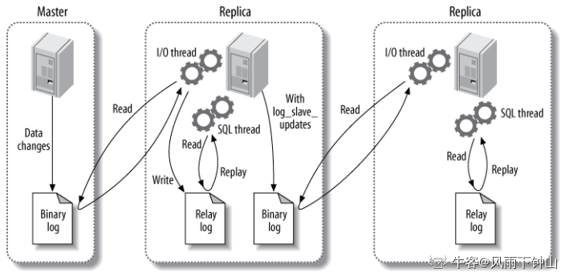

## [数据库]

### 什么是数据库,数据库管理系统,数据库系统,数据库管理员?

- **数据库**
  :数据库(DataBase 简称 DB)就是信息的集合或者说数据库是由数据库管理系统管理的数据的集合。
- **数据库管理系统** : 数据库管理系统(Database Management System
  简称 DBMS)是一种操纵和管理数据库的大型软件，通常用语用于建立、使用和维护数据库。
- **数据库系统** : 数据库系统(Data Base
  System，简称 DBS)通常由软件、数据库和数据管理员(DBA)组成。
- **数据库管理员** : 数据库管理员(Database
  Administrator,简称 DBA)负责全面管理和控制数据库系统。

### 什么是元组,码,候选码,主码,外码,主属性,非主属性？

- **元组** ：
  元组（tuple）是关系数据库中的基本概念，关系是一张表，表中的每行（即数据库中的每条记录）就是一个元组，每列就是一个属性。
  在二维表里，元组也称为行。
- **码** ：码就是能唯一标识实体的属性，对应表中的列。
- **候选码** ：
  若关系中的某一属性或属性组的值能唯一的标识一个元组，而其任何、子集都不能再标识，则称该属性组为候选码。例如：在学生实体中，“学号”是能唯一的区分学生实体的，同时又假设“姓名”、“班级”的属性组合足以区分学生实体，那么{学号}和{姓名，班级}都是候选码。
- **主码** : 主码也叫主键。主码是从候选码中选出来的。
  一个实体集中只能有一个主码，但可以有多个候选码。
- **外码** :
  外码也叫外键。如果一个关系中的一个属性是另外一个关系中的主码则这个属性为外码。
- **主属性** ： 候选码中出现过的属性称为主属性。比如关系
  工人（工号，身份证号，姓名，性别，部门）.显然工号和身份证号都能够唯一标示这个关系，所以都是候选码。工号、身份证号这两个属性就是主属性。如果主码是一个属性组，那么属性组中的属性都是主属性。
- **非主属性：**
  不包含在任何一个候选码中的属性称为非主属性。比如在关系——学生（学号，姓名，年龄，性别，班级）中，主码是“学号”，那么其他的“姓名”、“年龄”、“性别”、“班级”就都可以称为非主属性。

### 主键和外键有什么区别?

- **主键(主码)**
  ：主键用于唯一标识一个元组，不能有重复，不允许为空。一个表只能有一个主键。
- **外键(外码)**
  ：外键用来和其他表建立联系用，外键是另一表的主键，外键是可以有重复的，可以是空值。一个表可以有多个外键。

### 数据库范式了解吗?

#### 1NF(第一范式)

属性（对应于表中的字段）不能再被分割，也就是这个字段只能是一个值，不能再分为多个其他的字段了。**1NF 是所有关系型数据库的最基本要求**
，也就是说关系型数据库中创建的表一定满足第一范式。

#### 2NF(第二范式)

2NF 在 1NF 的基础之上，消除了非主属性对于码的部分函数依赖。如下图所示，展示了第一范式到第二范式的过渡。第二范式在第一范式的基础上增加了一个列，这个列称为主键，非主属性都依赖于主键。

#### 3NF(第三范式)

3NF 在 2NF 的基础之上，消除了非主属性对于码的传递函数依赖
。符合 3NF 要求的数据库设计，**基本**上解决了数据冗余过大，插入异常，修改异常，删除异常的问题。比如在关系 R(学号
,姓名, 系名，系主任)中，学号 → 系名，系名 →
系主任，所以存在非主属性系主任对于学号的传递函数依赖，所以该表的设计，不符合 3NF 的要求。

**总结**

- 1NF：属性不可再分。
- 2NF：1NF 的基础之上，消除了非主属性对于码的部分函数依赖。
- 3NF：3NF 在 2NF 的基础之上，消除了非主属性对于码的传递函数依赖 。

一些重要的概念：

- **函数依赖（functional dependency）**
  ：若在一张表中，在属性（或属性组）X 的值确定的情况下，必定能确定属性 Y 的值，那么就可以说 Y 函数依赖于 X，写作
  X → Y。
- **部分函数依赖（partial functional dependency）**
  ：如果 X→Y，并且存在 X 的一个真子集 X0，使得 X0→Y，则称 Y 对 X 部分函数依赖。比如学生基本信息表 R 中（学号，身份证号，姓名）当然学号属性取值是唯一的，在 R 关系中，（学号，身份证号）-\>（姓名），（学号）-\>（姓名），（身份证号）-\>（姓名）；所以姓名部分函数依赖与（学号，身份证号）；
- **完全函数依赖(Full functional dependency)**
  ：在一个关系中，若某个非主属性数据项依赖于全部关键字称之为完全函数依赖。比如学生基本信息表 R（学号，班级，姓名）假设不同的班级学号有相同的，班级内学号不能相同，在 R 关系中，（学号，班级）-\>（姓名），但是（学号）-\>(姓名)不成立，（班级）-\>(姓名)不成立，所以姓名完全函数依赖与（学号，班级）；
- **传递函数依赖** ：
  在关系模式 R(U)中，设 X，Y，Z 是 U 的不同的属性子集，如果 X 确定 Y、Y 确定 Z，且有 X 不包含 Y，Y 不确定 X，（X∪Y）∩Z=空集合，则称 Z 传递函数依赖(transitive
  functional dependency)
  于 X。传递函数依赖会导致数据冗余和异常。传递函数依赖的 Y 和 Z 子集往往同属于某一个事物，因此可将其合并放到一个表中。比如在关系 R(学号
  ,姓名, 系名，系主任)中，学号 → 系名，系名 →
  系主任，所以存在非主属性系主任对于学号的传递函数依赖。。

### 什么是存储过程?

我们可以把存储过程看成是一些 SQL
语句的集合，中间加了点逻辑控制语句。存储过程在业务比较复杂的时候是非常实用的，比如很多时候我们完成一个操作可能需要写一大串 SQL 语句，这时候我们就可以写有一个存储过程，这样也方便了我们下一次的调用。存储过程一旦调试完成通过后就能稳定运行，另外，使用存储过程比单纯 SQL 语句执行要快，因为存储过程是预编译过的。

存储过程在互联网公司应用不多，因为存储过程难以调试和扩展，而且没有移植性，还会消耗数据库资源。

### drop、delete 与 truncate 区别？

#### 用法不同

- drop(丢弃数据): `drop table 表名`
  ，直接将表都删除掉，在删除表的时候使用。
- truncate (清空数据) : `truncate table 表名`
  ，只删除表中的数据，再插入数据的时候自增长 id 又从 1 开始，在清空表中数据的时候使用。
- delete（删除数据） :
  `delete from 表名 where 列名=值`，删除某一列的数据，如果不加 where
  子句和`truncate table 表名`作用类似。

truncate 和不带 where 子句的 delete、以及 drop 都会删除表内的数据，但是
**truncate 和 delete
只删除数据不删除表的结构(定义)，执行 drop 语句，此表的结构也会删除，也就是执行
drop 之后对应的表不复存在。**

#### 属于不同的数据库语言

truncate 和 drop 属于 DDL(数据定义语言)语句，操作立即生效，原数据不放到
rollback segment 中，不能回滚，操作不触发 trigger。而 delete 语句是 DML
(数据库操作语言)语句，这个操作会放到 rollback segement
中，事务提交之后才生效。

**DML 语句和 DDL 语句区别：**

- DML 是数据库操作语言（Data Manipulation
  Language）的缩写，是指对数据库中表记录的操作，主要包括表记录的插入（insert）、更新（update）、删除（delete）和查询（select），是开发人员日常使用最频繁的操作。
- DDL （Data Definition
  Language）是数据定义语言的缩写，简单来说，就是对数据库内部的对象进行创建、删除、修改的操作语言。它和
  DML 语言的最大区别是 DML
  只是对表内部数据的操作，而不涉及到表的定义、结构的修改，更不会涉及到其他对象。DDL
  语句更多的被数据库管理员（DBA）所使用，一般的开发人员很少使用。

#### 执行速度不同

一般来说:drop\>truncate\>delete。

### 数据库设计通常分为哪几步?

1.  **需求分析** : 分析用户的需求，包括数据、功能和性能需求。
2.  **概念结构设计** : 主要采用 E-R 模型进行设计，包括画 E-R 图。
3.  **逻辑结构设计** :
    通过将 E-R 图转换成表，实现从 E-R 模型到关系模型的转换。
4.  **物理结构设计** :
    主要是为所设计的数据库选择合适的存储结构和存取路径。
5.  **数据库实施** : 包括编程、测试和试运行
6.  **数据库的运行和维护** : 系统的运行与数据库的日常维护。

### 事务的 ACID 特性是什么？

1.  **原子性：**
    事务是最小的执行单位，不允许分割。事务的原子性确保动作要么全部完成，要么完全不起作用；
2.  **一致性：**
    执行事务前后，数据保持一致，多个事务对同一个数据读取的结果是相同的；
3.  **隔离性：**
    并发访问数据库时，一个用户的事务不被其他事务所干扰，各并发事务之间数据库是独立的；
4.  **持久性：**
    一个事务被提交之后。它对数据库中数据的改变是持久的，即使数据库发生故障也不应该对其有任何影响。

### 并发事务带来哪些问题?

在典型的应用程序中，多个事务并发运行，经常会操作相同的数据来完成各自的任务（多个用户对统一数据进行操作）。并发虽然是必须的，但可能会导致以下的问题。

- **脏读（Dirty read）:**
  当一个事务正在访问数据并且对数据进行了修改，而这种修改还没有提交到数据库中，这时另外一个事务也访问了这个数据，然后使用了这个数据。因为这个数据是还没有提交的数据，那么另外一个事务读到的这个数据是“脏数据”，依据“脏数据”所做的操作可能是不正确的。
- **丢失修改（Lost to modify）:**
  指在一个事务读取一个数据时，另外一个事务也访问了该数据，那么在第一个事务中修改了这个数据后，第二个事务也修改了这个数据。这样第一个事务内的修改结果就被丢失，因此称为丢失修改。
  例如：事务 1 读取某表中的数据 A=20，事务 2 也读取 A=20，事务 1 修改 A=A-1，事务 2 也修改 A=A-1，最终结果 A=19，事务 1 的修改被丢失。
- **不可重复读（Unrepeatableread）:**
  指在一个事务内多次读同一数据。在这个事务还没有结束时，另一个事务也访问该数据。那么，在第一个事务中的两次读数据之间，由于第二个事务的修改导致第一个事务两次读取的数据可能不太一样。这就发生了在一个事务内两次读到的数据是不一样的情况，因此称为不可重复读。
- **幻读（Phantom read）:**
  幻读与不可重复读类似。它发生在一个事务（T1）读取了几行数据，接着另一个并发事务（T2）插入了一些数据时。在随后的查询中，第一个事务（T1）就会发现多了一些原本不存在的记录，就好像发生了幻觉一样，所以称为幻读。

#### 延伸问题：不可重复度和幻读有什么区别？

不可重复读的重点是修改，幻读的重点在于新增或者删除。

### 事务隔离级别有哪些? MySQL 的默认隔离级别是?

`SQL` 标准定义了四个隔离级别：

- **READ-UNCOMMITTED(读取未提交)：**
  最低的隔离级别，允许读取尚未提交的数据变更，**可能会导致脏读、幻读或不可重复读**。
- **READ-COMMITTED(读取已提交)：**
  允许读取并发事务已经提交的数据，**可以阻止脏读，但是幻读或不可重复读仍有可能发生**。
- **REPEATABLE-READ(可重复读)：**
  对同一字段的多次读取结果都是一致的，除非数据是被本身事务自己所修改，**可以阻止脏读和不可重复读，但幻读仍有可能发生**。
- **SERIALIZABLE(可串行化)：**
  最高的隔离级别，完全服从 ACID 的隔离级别。所有的事务依次逐个执行，这样事务之间就完全不可能产生干扰，也就是说，**该级别可以防止脏读、不可重复读以及幻读**。

隔离级别 脏读 不可重复读 幻影读

---

READ-UNCOMMITTED √ √ √
READ-COMMITTED × √ √
REPEATABLE-READ × × √
SERIALIZABLE × × ×

MySQL InnoDB 存储引擎的默认支持的隔离级别是
**REPEATABLE-READ（可重读）**。

### 乐观锁与悲观锁的区别

#### 悲观锁

总是假设最坏的情况，每次去拿数据的时候都认为别人会修改，所以每次在拿数据的时候都会上锁，这样别人想拿这个数据就会阻塞直到它拿到锁（**共享资源每次只给一个线程使用，其它线程阻塞，用完后再把资源转让给其它线程**）。传统的关系型数据库里边就用到了很多这种锁机制，比如行锁，表锁等，读锁，写锁等，都是在做操作之前先上锁。Java 中`synchronized`和`ReentrantLock`等独占锁就是悲观锁思想的实现。

#### 乐观锁

总是假设最好的情况，每次去拿数据的时候都认为别人不会修改，所以不会上锁，但是在更新的时候会判断一下在此期间别人有没有去更新这个数据，可以使用版本号机制和 CAS 算法实现。**乐观锁适用于多读的应用类型，这样可以提高吞吐量**，像数据库提供的类似于**write_condition 机制**，其实都是提供的乐观锁。在 Java 中`java.util.concurrent.atomic`包下面的原子变量类就是使用了乐观锁的一种实现方式**CAS**实现的。

#### 两种锁的使用场景

从上面对两种锁的介绍，我们知道两种锁各有优缺点，不可认为一种好于另一种，像**乐观锁适用于写比较少的情况下（多读场景）**，即冲突真的很少发生的时候，这样可以省去了锁的开销，加大了系统的整个吞吐量。但如果是多写的情况，一般会经常产生冲突，这就会导致上层应用会不断的进行 retry，这样反倒是降低了性能，所以**一般多写的场景下用悲观锁就比较合适。**

### 乐观锁常见的两种实现方式

#### 1. 版本号机制

一般是在数据表中加上一个数据版本号 version 字段，表示数据被修改的次数，当数据被修改时，version 值会加一。当线程 A 要更新数据值时，在读取数据的同时也会读取 version 值，在提交更新时，若刚才读取到的 version 值为当前数据库中的 version 值相等时才更新，否则重试更新操作，直到更新成功。

**举一个简单的例子：** 假设数据库中帐户信息表中有一个 version
字段，当前值为 1 ；而当前帐户余额字段（ balance ）为 \$100 。

1.  操作员 A 此时将其读出（ version=1 ），并从其帐户余额中扣除
    （50（100-\$50 ）。
2.  在操作员 A 操作的过程中，操作员 B 也读入此用户信息（ version=1
    ），并从其帐户余额中扣除 （20（100-\$20 ）。
3.  操作员 A 完成了修改工作，将数据版本号加一（ version=2
    ），连同帐户扣除后余额（ balance=\$50
    ），提交至数据库更新，此时由于提交数据版本大于数据库记录当前版本，数据被更新，数据库记录
    version 更新为 2 。
4.  操作员 B 完成了操作，也将版本号加一（ version=2
    ）试图向数据库提交数据（ balance=\$80
    ），但此时比对数据库记录版本时发现，操作员 B 提交的数据版本号为 2
    ，数据库记录当前版本也为 2 ，不满足 “
    提交版本必须大于记录当前版本才能执行更新 “
    的乐观锁策略，因此，操作员 B 的提交被驳回。

这样，就避免了操作员 B 用基于 version=1 的旧数据修改的结果覆盖操作员 A
的操作结果的可能。

#### 2. CAS 算法

即**compare and
swap（比较与交换）**，是一种有名的**无锁算法**。无锁编程，即不使用锁的情况下实现多线程之间的变量同步，也就是在没有线程被阻塞的情况下实现变量的同步，所以也叫非阻塞同步（Non-blocking
Synchronization）。**CAS 算法**涉及到三个操作数

- 需要读写的内存值 V
- 进行比较的值 A
- 拟写入的新值 B

当且仅当 V 的值等于
A 时，CAS 通过原子方式用新值 B 来更新 V 的值，否则不会执行任何操作（比较和替换是一个原子操作）。一般情况下是一个**自旋操作**，即**不断的重试**。

### 乐观锁的缺点

#### 1 ABA 问题

如果一个变量 V 初次读取的时候是 A 值，并且在准备赋值的时候检查到它仍然是 A 值，那我们就能说明它的值没有被其他线程修改过了吗？很明显是不能的，因为在这段时间它的值可能被改为其他值，然后又改回 A，那 CAS 操作就会误认为它从来没有被修改过。这个问题被称为 CAS 操作的
**"ABA"问题。**

JDK 1.5 以后的 `AtomicStampedReference 类`就提供了此种能力，其中的
`compareAndSet 方法`就是首先检查当前引用是否等于预期引用，并且当前标志是否等于预期标志，如果全部相等，则以原子方式将该引用和该标志的值设置为给定的更新值。

#### 2 循环时间长开销大

**自旋 CAS（也就是不成功就一直循环执行直到成功）如果长时间不成功，会给 CPU 带来非常大的执行开销。**
如果 JVM 能支持处理器提供的 pause 指令那么效率会有一定的提升，pause 指令有两个作用，第一它可以延迟流水线执行指令（de-pipeline）,使 CPU 不会消耗过多的执行资源，延迟的时间取决于具体实现的版本，在一些处理器上延迟时间是零。第二它可以避免在退出循环的时候因内存顺序冲突（memory
order violation）而引起 CPU 流水线被清空（CPU pipeline
flush），从而提高 CPU 的执行效率。

#### 3 只能保证一个共享变量的原子操作

CAS 只对单个共享变量有效，当操作涉及跨多个共享变量时 CAS 无效。但是从
JDK
1.5 开始，提供了`AtomicReference类`来保证引用对象之间的原子性，你可以把多个变量放在一个对象里来进行
CAS
操作.所以我们可以使用锁或者利用`AtomicReference类`把多个共享变量合并成一个共享变量来操作。

### MyISAM 和 InnoDB 的区别有哪些？

- `InnoDB` 支持事务，但是`MyISAM` 不支持事务。这也是 `MySQL` 选择
  `InnoDB`作为 默认存储引擎的原因之一；
- `InnoDB` 支持外键，但是 `MyISAM`
  不支持。如果一个表包含外键，并且存储引擎是`InnoDB`，把它转为
  `MyISAM`就会失败；
- `InnoDB`
  使用的是聚集索引，`MyISAM`使用非聚集索引。聚簇索引的文件存放在主键索引的叶子节点上，所以
  `InnoDB`
  必须要有主键，通过主键索引效率很高。但是辅助索引需要两次查询，先查询到主键，然后再通过主键查询到数据。所以，主键不应该过大，因为主键太大，其他索引也都会很大。非聚集索引的话，数据文件是分离的，索引保存的是数据文件的指针。主键索引和辅助索引是独立的。
- `InnoDB` 不保存表的具体行数，执行 `select count(*) from table`
  时需要全表扫描。但是`MyISAM`用一个变量保存了整个表的行数，执行上述语句时只需要读出该变量即可，速度很快；
- `InnoDB` 最小的锁粒度是行级锁，`MyISAM`
  最小的锁粒度是表级锁。一个更新语句会锁住整张表，导致其他查询和更新都会被阻塞，所以并发访问受到很大的限制。

#### 延伸问题：如何选择存储引擎？

1.  是否要支持事务，如果要请选择 `InnoDB`，如果不需要可以考虑 `MyISAM`；

2.  如果表中绝大多数都只是读查询，可以考虑
    `MyISAM`，如果既有读写也挺频繁，那就使用`InnoDB`。

3.  系统崩溃后，`MyISAM`恢复起来更困难，能否接受，不能接受就选
    `InnoDB`；

4.  `MySQL5.5`版本开始`InnoDB`已经成为`MySQL`的默认引擎，说明其优势是有目共睹的。如果不知道用什么存储引擎，那就用`InnoDB`，跟着官方走，至少不会差。

### MySQL 主从复制是怎么做的？

主从复制主要涉及三个线程：`binlog` 线程、`I/O` 线程和 `SQL`
线程。这个过程是靠这三个过程的密切配合来进行的。

- **binlog 线程**
  ：负责将主服务器上的数据更改写入二进制日志（`Binary log`）中。
- **I/O 线程**
  ：负责从主服务器上读取二进制日志，并写入从服务器的中继日志（`Relay log`）。
- **SQL 线程**
  ：负责读取中继日志，解析出主服务器已经执行的数据更改并在从服务器中重放（`Replay`）。

### 大表优化

当 MySQL 单表记录数过大时，数据库的 CRUD 性能会明显下降，一些常见的优化措施如下：

#### 1. 限定数据的范围

务必禁止不带任何限制数据范围条件的查询语句。比如：我们当用户在查询订单历史的时候，我们可以控制在一个月的范围内；

#### 2. 读/写分离

经典的数据库拆分方案，主库负责写，从库负责读；

#### 3. 垂直分区

**根据数据库里面数据表的相关性进行拆分。**
例如，用户表中既有用户的登录信息又有用户的基本信息，可以将用户表拆分成两个单独的表，甚至放到单独的库做分库。

**简单来说垂直拆分是指数据表列的拆分，把一张列比较多的表拆分为多张表。**

- **垂直拆分的优点：**
  可以使得列数据变小，在查询时减少读取的 Block 数，减少 I/O 次数。此外，垂直分区可以简化表的结构，易于维护。
- **垂直拆分的缺点：**
  主键会出现冗余，需要管理冗余列，并会引起 Join 操作，可以通过在应用层进行 Join 来解决。此外，垂直分区会让事务变得更加复杂；

#### 4. 水平分区

**保持数据表结构不变，通过某种策略存储数据分片。这样每一片数据分散到不同的表或者库中，达到了分布式的目的。
水平拆分可以支撑非常大的数据量。**

水平拆分是指数据表行的拆分，表的行数超过 200 万行时，就会变慢，这时可以把一张的表的数据拆成多张表来存放。举个例子：我们可以将用户信息表拆分成多个用户信息表，这样就可以避免单一表数据量过大对性能造成影响。

水平拆分可以支持非常大的数据量。需要注意的一点是：分表仅仅是解决了单一表数据过大的问题，但由于表的数据还是在同一台机器上，其实对于提升 MySQL 并发能力没有什么意义，所以
**水平拆分最好分库** 。

水平拆分能够 **支持非常大的数据量存储，应用端改造也少**，但
**分片事务难以解决** ，跨节点 Join 性能较差，逻辑复杂

### Redis 和 Memcached 的区别

1.  `Redis`支持更丰富的数据类型（支持更复杂的应用场景）：`Redis`不仅仅支持简单的`k/v`类型的数据，同时还提供`list`，`set`，`zset`，`hash`等数据结构的存储。`memcached`只支持简单的字符串类型。
2.  Redis 支持数据的持久化，可以将内存中的数据保持在磁盘中，重启的时候可以再次加载进行使用，而`Memecached`把数据全部存在内存之中。
3.  集群模式：`Memcached`没有原生的集群模式，需要依靠客户端来实现往集群中分片写入数据；但是
    `Redis` 目前是原生支持 `cluster` 模式的.
4.  `Memcached`是多线程，非阻塞`I/O`复用的网络模型；`Redis`使用单线程的多路
    `I/O` 复用模型。

### Redis 常见数据结构以及使用场景分析

#### String

`String`数据结构是简单的`key-value`类型，`value`其实不仅可以是`String`，也可以是数字。\
可以用作常规`key-value`缓存，也可以用来计数，比如说记录微博数，粉丝数等。

#### Hash

`hash` 是一个 `string` 类型的 `field` 和 `value` 的映射表，`hash`
特别适合用于存储对象，后续操作的时候，可以直接仅仅修改这个对象中的某个字段的值。
比如我们可以 `hash` 数据结构来存储用户信息，商品信息等等。

#### List

`list`
就是链表，`list`的应用场景非常多，也是`Redis`最重要的数据结构之一，比如微博的关注列表，粉丝列表，消息列表等功能都可以用`Redis`的
`list`
结构来实现。`list`的底层是一个双向链表，即可以支持反向查找和遍历，更方便操作，不过带来了部分额外的内存开销。

#### Set

`set` 对外提供的功能与`list`类似是一个列表的功能，特殊之处在于 `set`
是可以自动排重的。

当你需要存储一个列表数据，又不希望出现重复数据时，`set`是一个很好的选择，并且`set`提供了判断某个成员是否在一个`set`集合内的重要接口，这个也是`list`所不能提供的。可以基于
`set` 轻易实现交集、并集、差集的操作。

比如：在微博应用中，可以将一个用户所有的关注人存在一个集合中，将其所有粉丝存在一个集合。`Redis`可以非常方便的实现如共同关注、共同粉丝、共同喜好等功能。这个过程也就是求交集的过程。

#### Sorted Set

和`set`相比，`sorted set`增加了一个权重参数`score`，使得集合中的元素能够按`score`进行有序排列。

**举例：**
在直播系统中，实时排行信息包含直播间在线用户列表，各种礼物排行榜，弹幕消息（可以理解为按消息维度的消息排行榜）等信息，适合使用
`Redis` 中的 `Sorted Set` 结构进行存储。

### 什么是 AOF 重写？

`AOF`重写可以产生一个新的`AOF`文件，这个新的`AOF`文件和原有的`AOF`文件所保存的数据库状态一样，但体积更小。

在执行 `BGREWRITEAOF` 命令时，`Redis` 服务器会维护一个 AOF
重写缓冲区，该缓冲区会在子进程创建新`AOF`文件期间，记录服务器执行的所有写命令。当子进程完成创建新`AOF`文件的工作之后，服务器会将重写缓冲区中的所有内容追加到新`AOF`文件的末尾，使得新旧两个`AOF`文件所保存的数据库状态一致。最后，服务器用新的`AOF`文件替换旧的`AOF`文件，以此来完成`AOF`文件重写操作。

### 缓存雪崩和缓存穿透问题解决方案

#### 缓存雪崩

就是缓存同一时间大面积的失效，所以，后面的请求都会落到数据库上，造成数据库短时间内承受大量请求而崩掉。

解决办法：

- 事前：尽量保证整个 `Redis`
  集群的高可用性，发现机器宕机尽快补上。选择合适的内存淘汰策略。
- 事中：本地缓存 + `Hystrix`限流和降级，避免`MySQL`崩掉。
- 事后：利用 `Redis` 持久化机制保存的数据尽快恢复缓存。

#### 缓存穿透

一般是黑客故意去请求缓存中不存在的数据，导致所有的请求都落到数据库上，造成数据库短时间内承受大量请求而崩掉。

解决办法：

有很多种方法可以有效地解决缓存穿透问题，最常见的则是采用布隆过滤器，将所有可能存在的数据哈希到一个足够大的`bitmap`中，一个一定不存在的数据会被
这个`bitmap`拦截掉，从而避免了对底层存储系统的查询压力。另外也有一个更为简单粗暴的方法（我们采用的就是这种），如果一个查询返回的数据为空（不管是数据不存在，还是系统故障），我们仍然把这个空结果进行缓存，但它的过期时间会很短，最长不超过五分钟。

### 如何保证缓存与数据库双写时的数据一致性?

一般来说，就是如果系统不是严格要求缓存和数据库必须一致性的话，缓存可以稍微的跟数据库偶尔有不一致的情况，最好不要做这个方案，可以将读请求和写请求串行化，串到一个内存队列里去，这样就可以保证一定不会出现不一致的情况

串行化之后，就会导致系统的吞吐量会大幅度的降低，用比正常情况下多几倍的机器去支撑线上的一个请求。

### B 树和 B+树有什么区别？

B 树是一颗多路平衡查找树。

- 每个节点最多有 m-1 个**关键字**（可以存有的键值对）。
- 根节点最少可以只有 1 个**关键字**。
- 非根节点至少有 m/2 个**关键字**。
- 每个节点中的关键字都按照从小到大的顺序排列，每个关键字的左子树中的所有关键字都小于它，而右子树中的所有关键字都大于它。
- 所有叶子节点都位于同一层，或者说根节点到每个叶子节点的长度都相同。
- 每个节点都存有索引和数据，也就是对应的 key 和 value。

所以，根节点的**关键字**数量范围：`1 <= k <= m-1`，非根节点的**关键字**数量范围：`m/2 <= k <= m-1`。

另外，我们需要注意一个概念，描述一颗 B 树时需要指定它的阶数，阶数表示了一个节点最多有多少个孩子节点，一般用字母 m 表示阶数。

B+树其实和 B 树是非常相似的，我们首先看看**相同点**。

- 根节点至少一个元素
- 非根节点元素范围：m/2 \<= k \<= m-1

**不同点**。

- B+树有两种类型的节点：内部结点（也称索引结点）和叶子结点。内部节点就是非叶子节点，内部节点不存储数据，只存储索引，数据都存储在叶子节点。
- 内部结点中的 key 都按照从小到大的顺序排列，对于内部结点中的一个 key，左树中的所有 key 都小于它，右子树中的 key 都大于等于它。叶子结点中的记录也按照 key 的大小排列。
- 每个叶子结点都存有相邻叶子结点的指针，叶子结点本身依关键字的大小自小而大顺序链接。
- 父节点存有右孩子的第一个元素的索引。

B+树相对于 B 树有一些自己的优势，可以归结为下面几点。

- 单一节点存储的元素更多，使得查询的 IO 次数更少，所以也就使得它更适合做为数据库 MySQL 的底层数据结构了。
- 所有的查询都要查找到叶子节点，查询性能是稳定的，而 B 树，每个节点都可以查找到数据，所以不稳定。
- 所有的叶子节点形成了一个有序链表，更加便于查找。

参考：

- B+树的非叶子节点只是存储 key，占用空间非常小，因此每一层的节点能索引到的数据范围更加的广。换句话说，每次 IO 操作可以搜索更多的数据。
- 叶子节点两两相连，符合磁盘的预读特性。比如叶子节点存储 50 和 55，它有个指针指向了 60 和 62 这个叶子节点，那么当我们从磁盘读取 50 和 55 对应的数据的时候，由于磁盘的预读特性，会顺便把 60 和 62 对应的数据读取出来。这个时候属于顺序读取，而不是磁盘寻道了，加快了速度。
- 支持范围查询，而且部分范围查询非常高效，每个节点能索引的范围更大更精确,也意味着
  B+树单次磁盘 IO 的信息量大于 B-树,I/O 效率更高。

原因是数据都是存储在叶子节点这一层，并且有指针指向其他叶子节点，这样范围查询只需要遍历叶子节点这一层，无需整棵树遍历。

由于磁盘的存取速度与内存之间鸿沟,为了提高效率,要尽量减少磁盘 I/O.磁盘往往不是严格按需读取，而是每次都会预读,磁盘读取完需要的数据,会顺序向后读一定长度的数据放入内存。而这样做的理论依据是计算机科学中著名的局部性原理：

**当一个数据被用到时，其附近的数据也通常会马上被使用，程序运行期间所需要的数据通常比较集中**

#### 延伸问题：与哈希索引的区别？

简单地说，**哈希索引就是采用一定的哈希算法**，把键值换算成新的哈希值，检索时不需要类似 B+树那样从根节点到叶子节点逐级查找，只需一次哈希算法即可立刻定位到相应的位置，速度非常快。

- **如果是等值查询，那么哈希索引明显有绝对优势**，因为只需要经过一次算法即可找到相应的键值；当然了，这个前提是，键值都是唯一的。如果键值不是唯一的，就需要先找到该键所在位置，然后再根据链表往后扫描，直到找到相应的数据。
- **如果是范围查询检索，这时候哈希索引就毫无用武之地了**，因为原先是有序的键值，经过哈希算法后，有可能变成不连续的了，就没办法再利用索引完成范围查询检索。
- 同理，哈希索引也没办法利用索引完成排序，以及 like ‘xxx%’
  这样的部分模糊查询（这种部分模糊查询，其实本质上也是范围查询）。
- **哈希索引也不支持多列联合索引的最左匹配规则**。
- B+树索引的关键字检索效率比较平均，不像 B 树那样波动幅度大，**在有大量重复键值情况下，哈希索引的效率也是极低的，因为存在所谓的哈希碰撞问题**。

#### 红黑树和 AVL 树有什么区别？

AVL 和 RBT
都是二叉查找树的优化。其性能要远远好于二叉查找树。他们之间都有自己的优势，其应用上也有不同。

结构对比： AVL 的结构高度平衡，RBT 的结构基本平衡。平衡度 AVL \> RBT.

查找对比： AVL 查找时间复杂度最好，最坏情况都是 O(logN)。

RBT 查找时间复杂度最好为 O(logN)，最坏情况下比 AVL 略差。

插入删除对比： 1.
AVL 的插入和删除结点很容易造成树结构的不平衡，而 RBT 的平衡度要求较低。因此在大量数据插入的情况下，RBT 需要通过旋转变色操作来重新达到平衡的频度要小于 AVL。

1.  如果需要平衡处理时，RBT 比 AVL 多一种变色操作，而且变色的时间复杂度在 O(logN)数量级上。但是由于操作简单，所以在实践中这种变色仍然是非常快速的。
2.  当插入一个结点都引起了树的不平衡，AVL 和 RBT 都最多需要 2 次旋转操作。但删除一个结点引起不平衡后，AVL 最多需要 logN
    次旋转操作，而 RBT 最多只需要 3 次。因此两者插入一个结点的代价差不多，但删除一个结点的代价 RBT 要低一些。
3.  AVL 和 RBT 的插入删除代价主要还是消耗在查找待操作的结点上。因此时间复杂度基本上都是与 O(logN)
    成正比的。

总体评价：大量数据实践证明，RBT 的总体统计性能要好于平衡二叉树。
